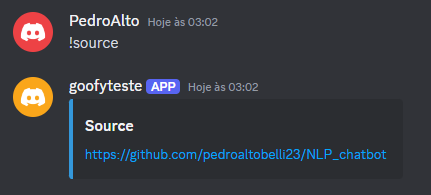
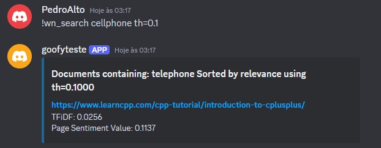
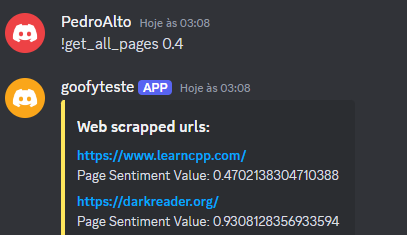

# Discord chatbot

Discord chatbot created for the NLP elective course at Insper

## How to run it:

**Warning:** Python version is 3.10

1. First of all, create a discord bot on the discord developer portal. You can follow this [tutorial](https://github.com/tiagoft/NLP/blob/main/deploy_de_bot_no_discord.md) to do it

2. <code>pip install -r requirements.txt</code>

3. then, create a .env file with:

    <pre>
        <code>TOKEN = Bot token</code>
        <code>KEY_RESET = Reset key for the command !reset</code>
        <code>FILE_CLASS_PICKLE = Name of a pickle file like: class1.pkl</code>
        <code>GUILD = Server Name where the bot is</code>
        <code>CHANNEL = Channel that the bot will use</code>
        <code>API_KEY = OpenAI API key</code>
</pre>

4. Download Wordnet using the following command on the python terminal:

    <pre>
        <code>import nltk</code>
        <code>nltk.download('wordnet')</code>
</pre>

5. Now, you are able to run it!

    <pre>
        <code>python3 chatbot.py</code>
</pre>

## Chatbot Commands

### On ready:

### !help:

Show help message describing all commands

### !source:

Returns the source code from this bot

### !author:

Returns the author's name

### !run:

get informations from IP address.

IPv4 format: x.x.x.x

IPv6 format y:y:y:y:y:y:y:y (also works with abreviation.e.g->2001:db8::)

!run [IPv4]

!run [IPv6] v6

API used: https://rapidapi.com/xakageminato/api/ip-geolocation-ipwhois-io

### !crawl

web crawling from webpage. Only receive 1 url and craw over a max of 15 pages. There is a timout with request takes more than 15 seconds.

!crawl <url>

### !search

Seach for a word or a phrase in the documents and show all the documents where the word appears and the TFiDF (measures how important a term is within a document relative to a collection of documents). You can use the argument th=X in the end for filtering pages by sentiment value. th default is 0 which means that filter wasn't applied. Goes from 0 (negative) to 1 (positive).

!search [word] [th=[value]]

### !wn_search

Search for one word in the documents and show all the documents where the word appears and the TFiDF (measures how important a term is within a document relative to a collection of documents). If the word is not in the documents, try to find synonims that is in the documents. You can use the argument th=X in the end for filtering pages by sentiment value. th default is 0 which means that filter wasn't applied. Goes from 0 (negative text) to 1 (positive text).

!wn_search [word] [th=[value]]

### !generate

Generate text from database using model

!generate [word]

### !get_all_pages

Get the url and sentiment value from all pages that have been webscrapped. You can use the argument th=X in the end for filtering pages by sentiment value. th default is 0 which means that filter wasn't applied. Goes from 0 (negative text) to 1 (positive text).

### !reset

Web crawling reset

!reset [secret_key]

## Essays:

- [Essay 0](essays/essay_0.md)

- [Essay 1](essays/essay_1.md)

- [Essay 2](essays/essay_2.md)

- [Essay 3](essays/essay_3.md)

- [Essay 4](essays/essay_4.md)

- [Essay 5](essays/essay_5.md)
